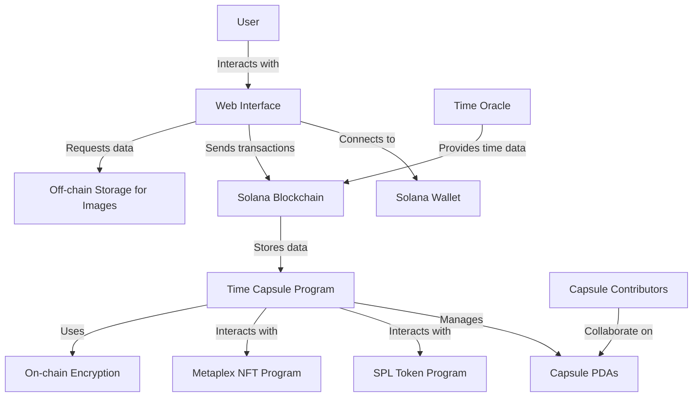

# Digital Time Capsule

## Overview

Digital Time Capsule is a decentralized application (dApp) built on the Solana blockchain that allows users to create, manage, and share time-locked digital capsules. These capsules can contain messages, images, and other digital content that are securely stored and can only be accessed at a predetermined future date.

## Features

- **Message and Image Storage**: Store text messages and image references securely on the Solana blockchain.
- **Time-based Access Control**: Set a future date for capsule opening, ensuring content remains private until then.
- **Multi-user Capsules**: Collaborate with friends to create shared memory capsules.
- **NFT Integration**: Each capsule is represented by a unique NFT, proving ownership and enabling potential trading.
- **Encrypted Content**: Securely encrypt capsule contents for privacy.
- **Program Derived Addresses (PDAs)**: Utilize PDAs for efficient capsule management and access.

## Project Structure

The project is organized into two main folders:

- `client/`: Contains the Next.js frontend application
- `contracts/`: Contains the Solana program written using Anchor

## System Architecture

Here's a high-level overview of the Digital Time Capsule system architecture:



## Technical Stack

- Solana Blockchain
- Rust (for Solana programs)
- Anchor Framework
- Next.js (for frontend)
- React.js
- Metaplex (for NFT functionality)

## Getting Started

### Prerequisites

- Rust and Cargo
- Solana CLI tools
- Node.js and npm
- Anchor Framework

### Installation

1. Clone the repository:
   ```
   git clone https://github.com/your-username/digital-time-capsule.git
   cd digital-time-capsule
   ```

2. Install dependencies for the Solana program:
   ```
   cd contracts
   anchor build
   ```

3. Deploy the program to a Solana cluster (e.g., devnet):
   ```
   anchor deploy
   ```

4. Install dependencies for the frontend:
   ```
   cd ../client
   npm install
   ```

5. Start the frontend development server:
   ```
   npm run dev
   ```

## Usage

The Digital Time Capsule application offers various features to preserve and manage your digital memories. Here's how to use the main functionalities:

### Home Page
- Visit the home page to get an overview of the Digital Time Capsule concept.
- Connect your wallet to access personalized features.
- Navigate to different sections of the application.

### Creating a Time Capsule
1. Go to the "Create" page.
2. Fill in the capsule details:
   - Title
   - Description
   - Opening date
   - Upload files (images, documents, etc.)
3. Choose whether to make the capsule public or private.
4. Submit the form to create your time capsule.

### Viewing Your Capsules
1. Navigate to the "My Capsules" page.
2. Browse through your list of created capsules.
3. Use the search and filter options to find specific capsules.
4. Click on a capsule to view its details.

### Capsule Details
- On the capsule detail page, you can:
  - View the capsule's title, status, and opening date.
  - See the countdown timer for sealed capsules.
  - Access the capsule's contents if it's opened.
  - Share, edit, or delete the capsule (if you're the owner).

### User Profile
1. Access your profile page to view your account information.
2. See statistics about your capsules.
3. Manage your account settings.

### About Page
- Visit the About page to learn more about the Digital Time Capsule concept, how it works, and its benefits.

### Wallet Integration
- Connect your Solana wallet to create and manage your time capsules.
- Your wallet is required for all capsule-related operations.

### Security and Privacy
- Capsules are securely stored on the blockchain.
- Set opening dates for future reveal of your capsule contents.
- Choose between public and private capsules for different levels of sharing.

Remember, all capsule operations (creation, viewing, and management) require a connected Solana wallet. Ensure your wallet is connected and has sufficient SOL for transaction fees when interacting with the application.

## Contributing

We welcome contributions to the Digital Time Capsule project! Please read our [CONTRIBUTING.md](CONTRIBUTING.md) file for details on our code of conduct and the process for submitting pull requests.

## License

This project is licensed under the MIT License - see the [LICENSE.md](LICENSE.md) file for details.

## Acknowledgments

### Core Technologies
- [Next.js](https://nextjs.org/): The React framework for building our web application.
- [React](https://reactjs.org/): The foundation of our user interface.
- [TypeScript](https://www.typescriptlang.org/): For adding static typing to our JavaScript codebase.

### Blockchain Integration
- [Solana](https://solana.com/): The blockchain platform powering our decentralized application.
- [@solana/web3.js](https://solana-labs.github.io/solana-web3.js/): For Solana blockchain interactions.
- [@coral-xyz/anchor](https://github.com/coral-xyz/anchor): The Solana development framework we used for smart contract integration.
- [@solana/wallet-adapter](https://github.com/solana-labs/wallet-adapter): For seamless wallet connection and management.

### UI Components and Styling
- [Tailwind CSS](https://tailwindcss.com/): For rapid and responsive UI development.
- [shadcn/ui](https://ui.shadcn.com/): Providing beautifully designed, accessible UI components.
- [Lucide React](https://lucide.dev/): For the iconography used throughout the application.
- [Framer Motion](https://www.framer.com/motion/): Adding smooth animations to enhance user experience.

### Data Management and APIs
- [Pinata SDK](https://github.com/PinataCloud/Pinata-SDK): For IPFS integration and decentralized file storage.
- [Axios](https://axios-http.com/): Handling HTTP requests for our API interactions.

### Development Tools
- [ESLint](https://eslint.org/): Ensuring code quality and consistency.
- [PostCSS](https://postcss.org/): For transforming CSS with JavaScript.

### Date Handling
- [date-fns](https://date-fns.org/): Modern JavaScript date utility library.

### File Handling
- [react-dropzone](https://react-dropzone.js.org/): For easy file uploads in our application.

### Community and Learning Resources
- [Solana Cookbook](https://solanacookbook.com/): An invaluable resource for Solana development best practices.
- [Anchor Documentation](https://www.anchor-lang.com/): Guiding our Solana program development.
- [Next.js Documentation](https://nextjs.org/docs): For in-depth Next.js features and API references.


## Contact

Alex Srebernic - [@ASrebernic](https://x.com/ASrebernic) - alexsrebernic@gmail.com

Project Link: [https://github.com/alexsrebernic/digital-time-capsule](https://github.com/alexsrebernic/digital-time-capsule)
